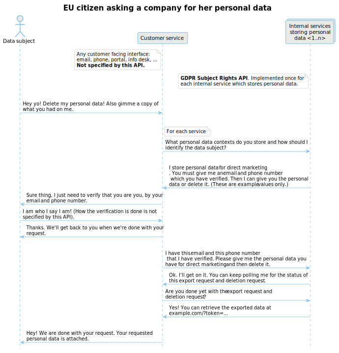
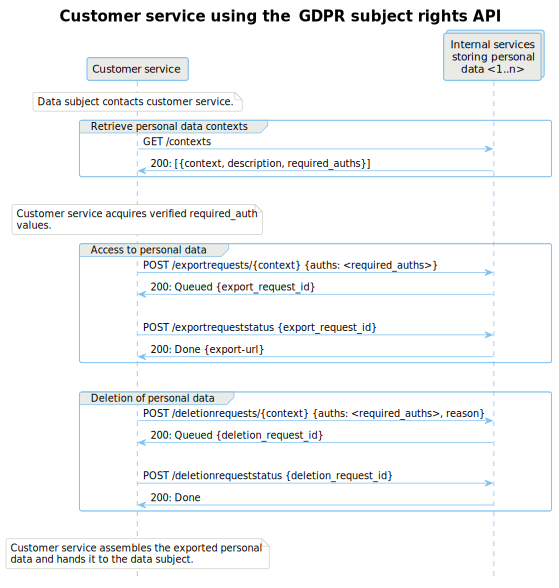

# GDPR Subject Rights API

## Summary

This is an [OpenAPI v3](https://www.openapis.org/) specification that intends
to be a partial solution for managing the [European Union's General Data Protection
Regulation (GDPR)](http://eur-lex.europa.eu/eli/reg/2016/679/oj) data subject
rights in an enterprise setting. It standardizes the way back office services
comply to data export and deletion requests.

## Background

The EU GDPR gives several rights to the persons (*data subjects*) whose
personal data is being processed (by a *data controller*):

- Right to request the personal data that is held by the controller;
- Right to trigger data erasure on certain grounds.

The challenge with many existing enterprises is that the current systems do not
allow these actions, either at all, or they lack central control over those
actions. Although many enterprises are building such data subject rights
management frameworks, including centralized processing permission (*consent*)
management frameworks, we thought that it would be interesting to try to create
a reference API that would facilitate the exercise of these rights.

At the time of writing, this work is just a draft API specification. There are
no actual implementations of the API. However, by publishing this as open
source we hope that this, or a similar approach, would be usable by someone
building or procuring software for their enterprise.

There are other projects and services that work in the similar domain, for example, [Adobe's GDPR API](https://www.adobe.io/apis/cloudplatform/gdpr.html) and the [OpenGDPR API](https://www.opengdpr.org/). This work was started independently and before we became aware of these initiatives. This API specification should fit well with the OpenGDPR flow - it essentially defines what the ["Request distribution"](https://github.com/opengdpr/opengdpr#request-sequence) would be in the OpenGDPR flow.

## Use cases

A typical use case for this kind of an API is where a company has a central
customer service function, which handles all requests from data subjects, while
the personal data is spread out into countless disparate
systems. As the number of these systems grows, so does the workload on the
customer service function which has to spray the data subject requests towards all the services through various channels. Whether this customer service function is automated through a
web portal or whether it is a person behind a phone number does not matter.

Another fairly common need for a standard GDPR subject rights API like this one
is when a company outsources some parts of their operation to a third party
services ("data processors" in the GDPR). In this scenario, it is
convenient to be able to contractually obligate the third party to implement a
de facto standard API.

This API also neatly enables shifting the responsibility and cost of GDPR
compliance from customer support to the service owners, where it belongs. If a
service owner is incapable of, or unwilling to implement this API, one can be
implemented for them. In such a case the API could merely be a frontend for a
ticketing system which drives the manual work incurred from data subject
requests.

This API only specifies the data subject rights as prescribed by GDPR articles
15 and 17. It does not cover GDPR as a whole, e.g., consent management.

## Technical overview

The following sequence chart zooms in on the usage of the GDPR subject rights
API. The examples shown here focus on highlighting the relationships between the
different API operations. As such, these diagrams are limited to the happy-case
and lack many of the finer details which the API specifies. For a
comprehensive understanding please do [explore the openapi.yaml](#usage).

### The data subject's user experience

When a data subject would like to exercise a right for access to, or erasure of
data, the data subject would submit a relevant request to the data controller.
In this case, this request would likely to be done through an externally facing
web site provided by the enterprise.

The web site would authenticate the data subject using any means necessary
(more on this later). Once authenticated, the web site would send the data
access or erasure requests to each of the identified services, and produce a
receipt to the data subject.

The data subject could later use the receipt to see the status of the access or
erasure request, and in the case of the access request, download the data.

### From the perspective of a well-maintained service

Those services that are well-maintained and are resourced appropriately to be
able to implement new functional features, would implement the API and register
their API endpoint with the externally facing web site. This allows the web
site to determine which type of authentication would be needed from the data
subject, and to directly pass the data access or erasure request to the
back-end service.

### From the perspective of a legacy, maintenance-mode service

Those back-end services that cannot entertain implementing new functionality,
perhaps due to technical debt or the lack of investment, obviously cannot
implement this API. The better option would be either to ditch such services
altogether, or build a wrapper for them.

If neither of these is a viable alternative, the enterprise architect would
then provide the API endpoint for these services from a central location. This
central location would receive the API requests and then send the request
forward for manual processing. This could mean opening a ticket for the
back-end service's administrators, or in the worst case, sending an email
notification to the business owner of the non-compliant back-end service. After
manually completing the request, the admins would have to manually submit the
results of the request back to the central location.

This will, obviously, have the possibility of generating significant amounts of
manual tasks. However, now the work and related costs are directly shifted on
the non-compliant service. Other corporate functions, like customer service,
will not have to bear the additional costs of manual processing in their
budgets. This should drive the investment in the back-end services, or
alternatively, fasten their demise.

### A finer point on contextual agnosticism

The API has been designed to be agnostic to the context in which the personal
data is being processed.

There may be no overarching concept of a "user" or, indeed, any common
identifier for data subjects across the enterprise. Some back-end services
might identify their data subjects with an email address, some others by a
customer or telephone number, some with a national ID, and some with only a
name.

The API has a query interface (`GET /contexts`) where the data subject-facing
web site can query each registered API endpoint for the identifiers they use,
and which type of personal data they hold on the data subjects.

It is the responsibility of the data subject-facing web site to perform
authentication for each of the identifiers. For example, it could send
challenge-response emails or text message, or require the user to sign in on
the service.

## Security aspects

### API security

This API is intended to be internal to the enterprise, and is not intended to
be exposed to unauthorised parties. As these API calls enable access to
personal data, we strongly recommend that:

- All API calls and responses should be transported over a secure transport
  channel where the security is *not* based solely on a concept of a "secure"
  network;
- The API calls would be authenticated and integrity protected, with all
  authorised callers having distinct authentication secrets (no shared access
  keys);
- All calls to the externally-facing web site, and this API, would generate an
  audit log entry that has sufficient forensic qualities and monitoring in
  place.

### Countering identity theft

It is possible that identity thieves would use this type of service to obtain
more data on their victims. While this API specification does not dictate how
the subject-facing interface should be implemented, we propose the following:

- When receiving a data subject request, a notification would be sent through
  every (electronic) communications channel to the data subject. This can
  sometimes be done in conjunction with the data subject authentication phase.
- Even if the response from the back-end services would be immediate, there
  would be an artificial waiting period (e.g., 7 to 14 days), after which
  another notification would be sent to the data subject. The waiting period
  aims to make it harder to conduct attacks with a restricted time window
  (e.g., using a freshly stolen phone or opportunistically using an unlocked
  laptop).
- Before providing access to downloadable archives of personal data, the data
  subject could be made to go through at least one of the authentication phases
  once more.
- The download location for the personal data should be short-lived and
  impossible to guess.

## Usage

You can use the [online editor](https://editor.swagger.io/?url=https://raw.githubusercontent.com/F-Secure/gdpr-subject-rights-api/master/openapi.yaml)
to explore and edit the API specification.

You can also use any of the [available OpenAPI
tools](https://github.com/OAI/OpenAPI-Specification/blob/master/IMPLEMENTATIONS.md)
to explore, prototype or generate implementation skeletons in multiple
programming languages.

## Contributing

[Open an issue](https://github.com/F-Secure/gdpr-subject-rights-api/issues/new).
Pull requests are also more than welcome!

## History

* v1 - First open sourced version.

## License

[APLv2](LICENSE) - © F-Secure

## Acknowledgements

The first version was thrown together by Mathias Nyman, Hiski Ruhanen and Antti Vähä-Sipilä late 2017/early 2018.

